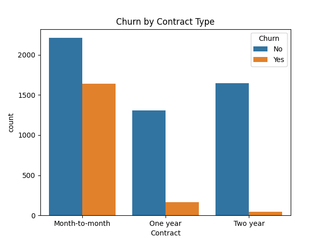
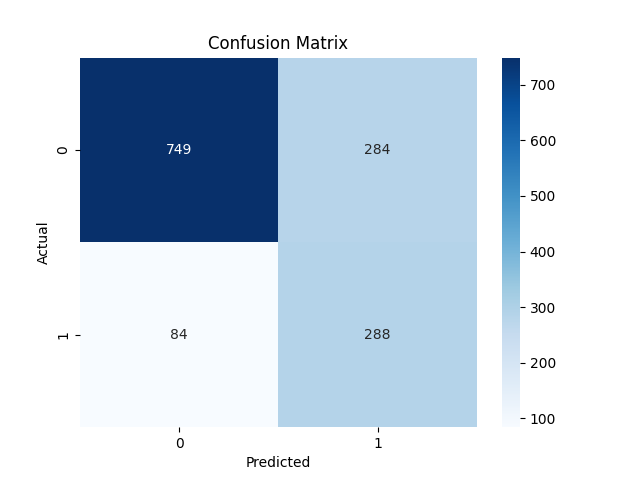
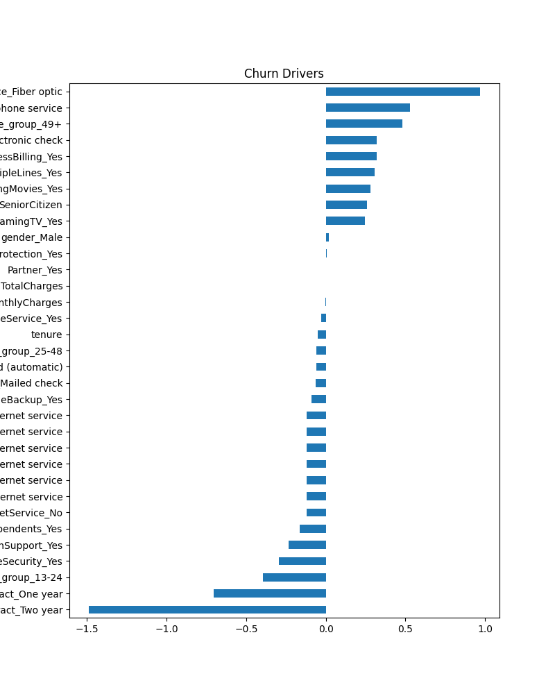

# Customer Churn Prediction

## Problem Statement
A telecom company wants to know which customers are likely to cancel their subscription (churn) based on their service usage and contract details, so it can intervene before they leave.

## Dataset
- **Name:** Telco Customer Churn Dataset
- **Source:** Kaggle (blastchar)
- **Link:** https://www.kaggle.com/datasets/blastchar/telco-customer-churn
- **Rows / Columns:** 7021 rows (after removing duplicates), 20 columns

## Tools Used
- Python, Pandas, NumPy
- Matplotlib, Seaborn
- Scikit-learn
- Streamlit (for deployment)

## Workflow
1. Data Collection
2. Data Cleaning (fixed TotalCharges datatype, removed duplicates, dropped customerID)
3. Exploratory Data Analysis (EDA)
4. Feature Engineering (tenure grouping, one-hot encoding)
5. Model Building (Logistic Regression)
6. Evaluation
7. Deployment (Streamlit app)

## Results
- **Model:** Logistic Regression
- **Accuracy:** 0.738
- **Precision:** 0.503
- **Recall:** 0.774
- **F1 Score:** 0.610

## Top Churn Drivers
- Fiber optic internet, electronic check payment, and paperless billing are the strongest churn drivers
- Two-year and one-year contracts are the strongest factors keeping customers from churning

## Retention Strategies
1. Offer contract-upgrade incentives to month-to-month customers, especially in their first 12 months
2. Investigate service/pricing issues with fiber optic plans
3. Encourage customers to switch from electronic check to automatic payment methods

## Screenshots

## Live App
[Streamlit App Link — add after deployment]

## Future Improvements
- Try a Random Forest model and compare performance
- Collect more data to reduce class imbalance

## Author
princekumar-cse
